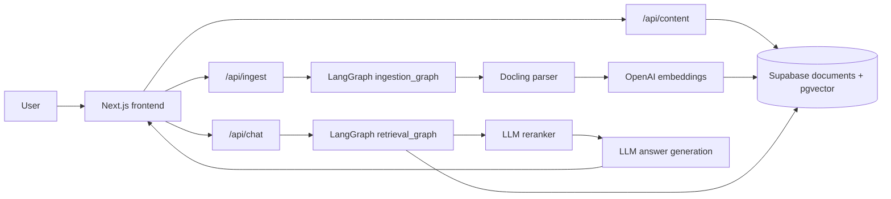
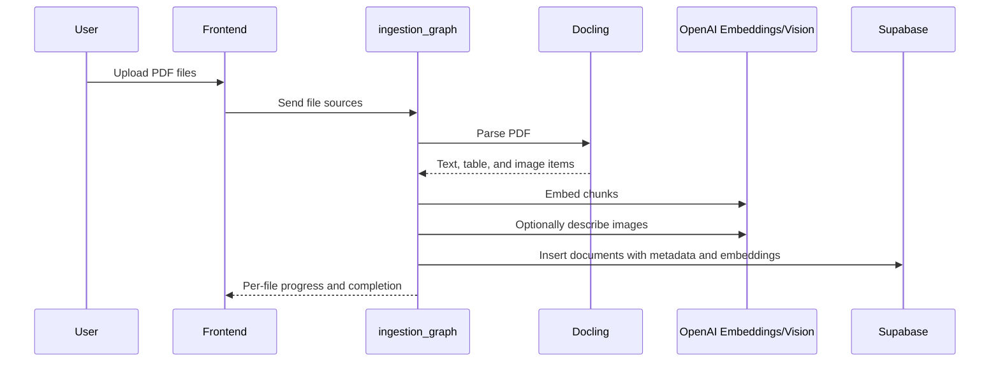
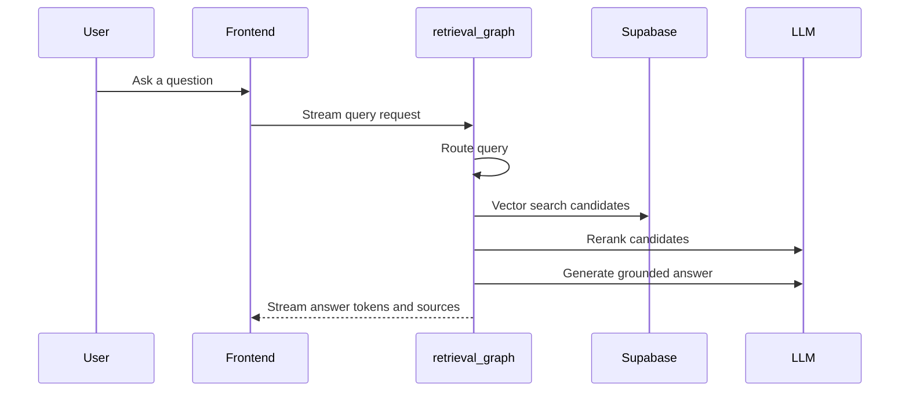

# PDF Chatbot

RAG-based PDF Q&A application. Users upload PDF documents, the backend parses and chunks them with Docling, embeddings are stored in Supabase pgvector, and users can ask questions through a streaming chat UI with source attribution.

The current app supports text, table, and image-aware ingestion, document deletion from the UI, file-level ingest progress, reranking after vector search, and a Knowledge sidebar for browsing ingested files, extracted tables, and extracted images.

## Features

- Upload and ingest PDF files from the chat UI.
- Track ingest progress per file.
- Parse PDF text, tables, and images with Docling and `HybridChunker`.
- Extract table content as markdown and preview it in the sidebar.
- Extract PDF images, store bounded preview metadata, and preview images in the sidebar.
- Generate optional image descriptions with a vision model during ingestion.
- Store chunks and embeddings in Supabase PostgreSQL with pgvector.
- Stream chat responses through Server-Sent Events.
- Return sources with content type, page range, file name, and title metadata.
- Rerank vector-search candidates before answer generation.
- Delete all chunks, tables, images, and embeddings for a file from the UI.

## Architecture



### Ingestion Flow



### Retrieval Flow



## Tech Stack

| Layer | Technology |
| --- | --- |
| Frontend | Next.js 14, React 18, TypeScript, Tailwind CSS |
| UI components | Radix UI, lucide-react |
| Backend orchestration | Python, LangGraph, LangChain, Pydantic |
| PDF parsing | Docling, HybridChunker |
| Vector database | Supabase PostgreSQL, pgvector |
| LLM | OpenAI chat model, reranking model, optional vision model |
| Embeddings | `text-embedding-3-small` |
| Streaming | Server-Sent Events |

## Repository Structure

```text
.
├── backend/
│   ├── src/ingestion_graph/
│   │   ├── graph.py              # LangGraph ingestion workflow
│   │   ├── docling_parser.py     # PDF parsing, table/image extraction
│   │   └── state.py              # Ingestion graph state types
│   ├── src/retrieval_graph/
│   │   ├── graph.py              # Retrieval, reranking, answer generation
│   │   ├── prompts.py            # System prompts
│   │   ├── rerank.py             # Candidate reranking
│   │   └── utils.py              # Retrieved document formatting
│   └── src/shared/
│       ├── retrieval.py          # Supabase vector store wrapper
│       └── utils.py              # Chat model loading
├── frontend/
│   ├── app/
│   │   ├── page.tsx              # Main chat UI
│   │   └── api/
│   │       ├── chat/route.ts     # Streaming chat endpoint
│   │       ├── ingest/route.ts   # Upload and ingestion endpoint
│   │       └── content/route.ts  # Knowledge sidebar and deletion endpoint
│   ├── components/
│   │   ├── chat-message.tsx      # Message, source, and activity rendering
│   │   └── knowledge-sidebar.tsx # Files, tables, images, deletion UI
│   ├── config/                  # Frontend server/public configuration
│   ├── lib/langgraph-base.ts     # LangGraph SDK wrapper
│   └── types/graphTypes.ts       # Shared frontend graph types
├── package.json                  # Root Yarn workspace scripts
└── README.md
```

## Prerequisites

- Python `3.11+`
- Node.js `18+`
- Yarn `1.x`
- Supabase project
- OpenAI API key
- LangSmith API key, optional but recommended for tracing

Useful links:

- [Supabase dashboard](https://supabase.com/dashboard)
- [Supabase API keys](https://supabase.com/docs/guides/api/api-keys)
- [OpenAI platform](https://platform.openai.com/)
- [OpenAI API keys](https://help.openai.com/en/articles/4936850-how-to-create-and-use-an-api-key)
- [LangSmith](https://smith.langchain.com/)

## Environment Variables

Create the env files from the examples:

```bash
cp backend/.env.example backend/.env
cp frontend/.env.example frontend/.env
```

Most behavior can be changed through env values. Model names, retrieval settings, upload limits, and image extraction settings should not require code changes.

### `backend/.env`

```env
OPENAI_API_KEY=your-openai-api-key

SUPABASE_URL=https://your-project-ref.supabase.co
SUPABASE_SERVICE_ROLE_KEY=your-supabase-service-role-key

CHAT_MODEL=openai/gpt-4o-mini
VISION_MODEL=gpt-4o-mini
EMBEDDING_MODEL=text-embedding-3-small
MODEL_TEMPERATURE=0.2

RETRIEVER_PROVIDER=supabase
RETRIEVAL_K=5
RETRIEVAL_CANDIDATE_K=12
RETRIEVAL_RERANK=true
RETRIEVAL_MAX_ITERATIONS=3

DOCLING_OCR=true
DOCLING_TABLE_STRUCTURE=true
ENABLE_IMAGE_EXTRACTION=true
ENABLE_IMAGE_DESCRIPTIONS=true
MAX_IMAGE_DESCRIPTIONS_PER_FILE=20
PDF_IMAGE_SCALE=2.0
PDF_IMAGE_MAX_EDGE=1400
MAX_IMAGE_PREVIEW_BYTES=1500000

LANGCHAIN_TRACING_V2=true
LANGCHAIN_API_KEY=your-langsmith-api-key
LANGCHAIN_PROJECT=pdf-chatbot
```

### `frontend/.env`

```env
NEXT_PUBLIC_LANGGRAPH_API_URL=http://localhost:2024
LANGGRAPH_INGESTION_ASSISTANT_ID=ingestion_graph
LANGGRAPH_RETRIEVAL_ASSISTANT_ID=retrieval_graph

SUPABASE_URL=https://your-project-ref.supabase.co
SUPABASE_SERVICE_ROLE_KEY=your-supabase-service-role-key

CHAT_MODEL=openai/gpt-4o-mini
RETRIEVAL_K=5
RETRIEVAL_CANDIDATE_K=12
RETRIEVAL_RERANK=true

NEXT_PUBLIC_MAX_UPLOAD_FILES=5
NEXT_PUBLIC_MAX_UPLOAD_MB=10
NEXT_PUBLIC_KNOWLEDGE_PAGE_SIZE=10

LANGCHAIN_TRACING_V2=true
LANGCHAIN_API_KEY=your-langsmith-api-key
LANGCHAIN_PROJECT=pdf-chatbot
```

### Variable Reference

| Variable | Required | Used by | Description |
| --- | --- | --- | --- |
| `OPENAI_API_KEY` | Yes | Backend | OpenAI API key for chat, embeddings, reranking, and optional vision descriptions. |
| `SUPABASE_URL` | Yes | Backend, Frontend API routes | Supabase project URL. |
| `SUPABASE_SERVICE_ROLE_KEY` | Yes | Backend, Frontend API routes | Server-side key for insert, list, and delete operations. Do not expose it with `NEXT_PUBLIC_`. |
| `NEXT_PUBLIC_LANGGRAPH_API_URL` | Yes | Frontend, Frontend API routes | LangGraph API URL, usually `http://localhost:2024`. |
| `LANGGRAPH_INGESTION_ASSISTANT_ID` | Yes | Frontend API routes | LangGraph assistant ID for ingestion. |
| `LANGGRAPH_RETRIEVAL_ASSISTANT_ID` | Yes | Frontend API routes | LangGraph assistant ID for retrieval/chat. |
| `CHAT_MODEL` | No | Backend, Frontend API routes | Chat, routing, reranking, and answer model. Default: `openai/gpt-4o-mini`. |
| `VISION_MODEL` | No | Backend | Vision model for image descriptions. Default: `gpt-4o-mini`. |
| `EMBEDDING_MODEL` | No | Backend | Embedding model. Default: `text-embedding-3-small`. Changing dimensions requires Supabase schema changes. |
| `MODEL_TEMPERATURE` | No | Backend | Temperature for chat-model calls. Default: `0.2`. |
| `RETRIEVER_PROVIDER` | No | Backend | Retriever backend. Current supported value: `supabase`. |
| `RETRIEVAL_K` | No | Backend, Frontend API routes | Final number of documents used for answer generation. Default: `5`. |
| `RETRIEVAL_CANDIDATE_K` | No | Backend, Frontend API routes | Vector candidates fetched before reranking. Default: `12`. |
| `RETRIEVAL_RERANK` | No | Backend, Frontend API routes | Enables LLM reranking. Default: `true`. |
| `RETRIEVAL_MAX_ITERATIONS` | No | Backend | Maximum retrieval sufficiency loop count. Default: `3`. |
| `DOCLING_OCR` | No | Backend | Enables Docling OCR. Default: `true`. |
| `DOCLING_TABLE_STRUCTURE` | No | Backend | Enables Docling table structure extraction. Default: `true`. |
| `ENABLE_IMAGE_EXTRACTION` | No | Backend | Enables image item extraction and preview generation. Default: `true`. |
| `ENABLE_IMAGE_DESCRIPTIONS` | No | Backend | Set `false` to skip vision-model image descriptions while still extracting image previews. |
| `MAX_IMAGE_DESCRIPTIONS_PER_FILE` | No | Backend | Maximum number of images per file sent to the vision model. Default: `20`. |
| `PDF_IMAGE_SCALE` | No | Backend | Docling image rendering scale. Default: `2.0`. |
| `PDF_IMAGE_MAX_EDGE` | No | Backend | Maximum edge size for stored image previews. Default: `1400`. |
| `MAX_IMAGE_PREVIEW_BYTES` | No | Backend | Maximum encoded preview bytes stored in metadata. Default: `1500000`. |
| `NEXT_PUBLIC_MAX_UPLOAD_FILES` | No | Frontend | Maximum PDFs selectable per upload batch. Default: `5`. |
| `NEXT_PUBLIC_MAX_UPLOAD_MB` | No | Frontend, Frontend API routes | Maximum size per PDF. Default: `10`. |
| `NEXT_PUBLIC_KNOWLEDGE_PAGE_SIZE` | No | Frontend | Reserved sidebar page size for future pagination. Default: `10`. |
| `LANGCHAIN_TRACING_V2` | No | Backend, Frontend API routes | Enables LangSmith tracing when set to `true`. |
| `LANGCHAIN_API_KEY` | No | Backend, Frontend API routes | LangSmith API key. |
| `LANGCHAIN_PROJECT` | No | Backend, Frontend API routes | LangSmith project name. |

## Supabase Setup

Open the Supabase SQL Editor and run:

```sql
create extension if not exists vector;
create extension if not exists pgcrypto;

create table documents (
  id uuid primary key default gen_random_uuid(),
  content text,
  metadata jsonb,
  embedding vector(1536)
);

create or replace function match_documents (
  query_embedding vector(1536),
  match_count int default null,
  filter jsonb default '{}'
) returns table (
  id uuid,
  content text,
  metadata jsonb,
  embedding jsonb,
  similarity float
)
language plpgsql
as $$
#variable_conflict use_column
begin
  return query
  select
    documents.id,
    documents.content,
    documents.metadata,
    (documents.embedding::text)::jsonb as embedding,
    1 - (documents.embedding <=> query_embedding) as similarity
  from documents
  where documents.metadata @> filter
  order by documents.embedding <=> query_embedding
  limit match_count;
end;
$$;
```

The `documents.embedding` dimension is `1536` because the default embedding model is `text-embedding-3-small`.

## Installation

From the repository root:

```bash
yarn install
python3.11 -m venv .venv
source .venv/bin/activate
pip install -r backend/requirements.txt
```

## Running Locally

Run the backend and frontend in separate terminals from the repository root.

Terminal 1, backend:

```bash
source .venv/bin/activate
yarn backend:dev
```

Terminal 2, frontend:

```bash
yarn frontend:dev
```

Local URLs:

- Frontend: `http://localhost:3000`
- LangGraph API: `http://localhost:2024`
- LangGraph Studio: printed by `yarn backend:dev` when available

## Usage

1. Open `http://localhost:3000`.
2. Upload PDF files with the attachment button.
3. Watch the per-file ingestion progress.
4. Use the Knowledge sidebar to inspect files, tables, and images.
5. Click a table to open its markdown table preview.
6. Click an image to open its image preview.
7. Ask questions in the chat input.
8. Inspect source cards under assistant answers.
9. Delete a file from the Knowledge sidebar when it should be removed from Supabase.

## Development Commands

```bash
# Frontend development server
yarn frontend:dev

# Backend LangGraph development server
source .venv/bin/activate
yarn backend:dev

# Frontend production build
yarn frontend:build

# TypeScript check
node node_modules/typescript/bin/tsc --noEmit -p frontend/tsconfig.json

# Whitespace check before committing
git diff --check
```

## Retrieval Configuration

Retrieval defaults are centralized in env values and read by both the frontend API route and backend graph fallback.

Current default behavior:

- `CHAT_MODEL=openai/gpt-4o-mini`
- `RETRIEVAL_CANDIDATE_K=12` vector-search candidates before reranking.
- `RETRIEVAL_RERANK=true` to rerank candidates with an LLM.
- `RETRIEVAL_K=5` final documents for answer generation.
- `RETRIEVAL_MAX_ITERATIONS=3` sufficiency-check iterations.

## Image Extraction Configuration

Image extraction is controlled by `ENABLE_IMAGE_EXTRACTION`. When enabled, the parser sets Docling `PdfPipelineOptions.generate_picture_images = true`.

There are three separate image-related behaviors:

1. Image detection and preview extraction from PDF.
2. Preview storage in document metadata.
3. Optional text descriptions generated by the vision model.

`ENABLE_IMAGE_DESCRIPTIONS=false` disables only the vision-model description step. It does not disable image detection or preview extraction when `ENABLE_IMAGE_EXTRACTION=true`.

Default image limits:

```env
ENABLE_IMAGE_EXTRACTION=true
ENABLE_IMAGE_DESCRIPTIONS=true
MAX_IMAGE_DESCRIPTIONS_PER_FILE=20
PDF_IMAGE_SCALE=2.0
PDF_IMAGE_MAX_EDGE=1400
MAX_IMAGE_PREVIEW_BYTES=1500000
```

For local testing with very high limits:

```env
ENABLE_IMAGE_EXTRACTION=true
ENABLE_IMAGE_DESCRIPTIONS=true
MAX_IMAGE_DESCRIPTIONS_PER_FILE=999999
MAX_IMAGE_PREVIEW_BYTES=100000000
PDF_IMAGE_MAX_EDGE=4000
PDF_IMAGE_SCALE=2.0
```

The code currently expects numeric values. It does not support `unlimited` as a literal value.

## Operational Notes

- Run commands from the repository root unless a command says otherwise.
- Activate `.venv` before running the backend because `langgraph`, Docling, LangChain, and Supabase Python dependencies are installed there.
- Keep `SUPABASE_SERVICE_ROLE_KEY` server-side only. Do not prefix it with `NEXT_PUBLIC_`.
- `frontend/.env` also needs Supabase credentials because `/api/content` lists and deletes document rows from a Next.js server route.
- The app currently accepts only PDF uploads.
- The upload limit defaults to `5` files per batch and `10MB` per file. Change `NEXT_PUBLIC_MAX_UPLOAD_FILES` and `NEXT_PUBLIC_MAX_UPLOAD_MB` to adjust it.
- If an image is detected but the preview is too large, the image still appears in the sidebar, but the dialog shows a fallback instead of a preview.
- If no images appear for a PDF, check `ENABLE_IMAGE_EXTRACTION`; if it is enabled, Docling likely did not classify any element as a `PictureItem` for that file.
- Browserlist warnings during frontend build are informational and do not block the build.

## Current Limitations

- No authentication or per-user document isolation. All sessions share the same Supabase `documents` table.
- Chat thread history is not persisted after page refresh.
- Image previews are stored in metadata with a size cap. A production setup should move large previews to object storage.
- There is no automated browser screenshot test suite yet.
- Retrieval filtering is available through metadata but there is no full user-facing filter UI yet.

## Suggested Improvements

- Add authentication and per-user document ownership.
- Store image previews in Supabase Storage instead of JSONB metadata.
- Add Playwright E2E tests for upload, delete, table preview, image preview, and chat streaming.
- Persist chat threads and message history.
- Add document-level metadata filters in the chat UI.
- Add RAG evaluation datasets and regression checks.
