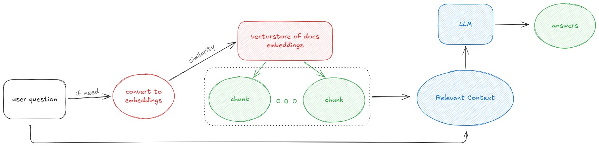
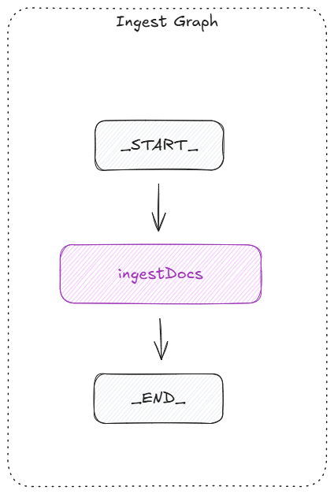
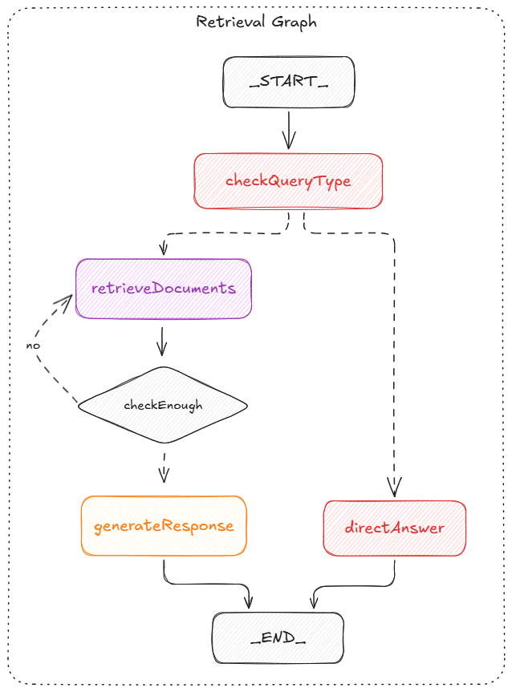
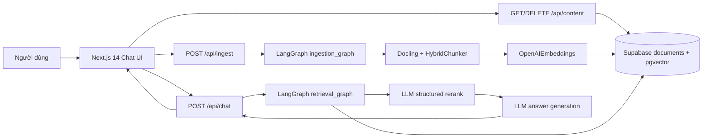
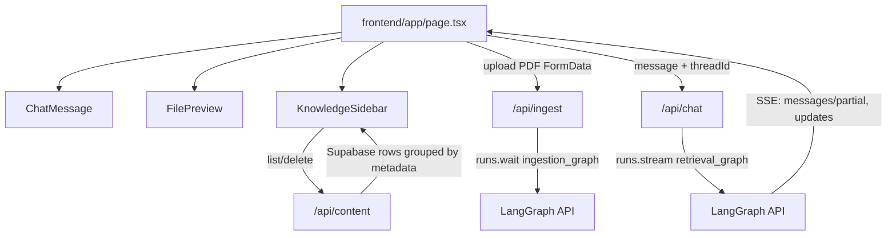
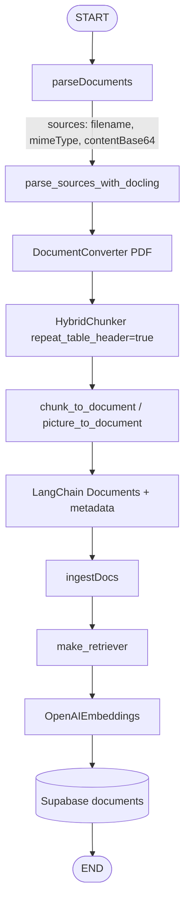
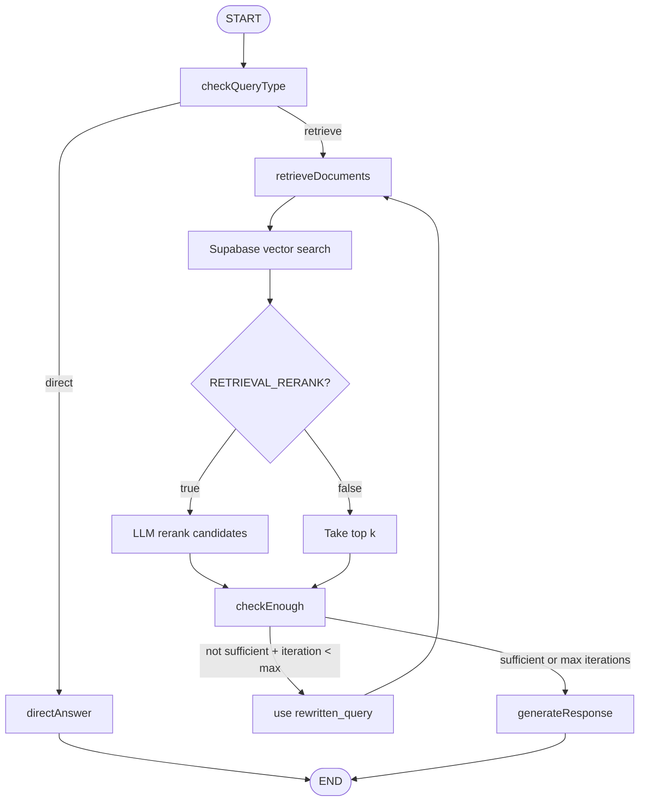
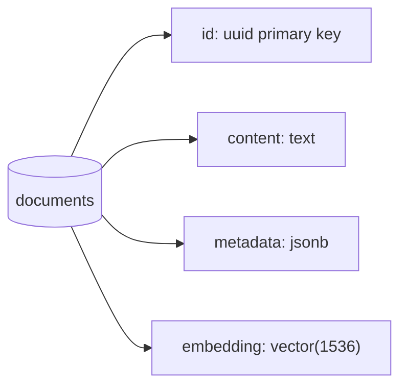

# PDF Chatbot

> RAG-based PDF Q&A application: upload PDF, parse bằng Docling, lưu embedding vào Supabase pgvector, hỏi đáp qua LangGraph retrieval pipeline và stream câu trả lời kèm nguồn về Next.js UI.

## Mục Lục

- [Tổng Quan](#tổng-quan)
- [Kết Quả Đạt Được](#kết-quả-đạt-được)
- [Sơ Đồ Hệ Thống](#sơ-đồ-hệ-thống)
- [Kiến Trúc Chi Tiết](#kiến-trúc-chi-tiết)
- [Phương Pháp Xử Lý Từng Thành Phần](#phương-pháp-xử-lý-từng-thành-phần)
- [Cấu Trúc Thư Mục](#cấu-trúc-thư-mục)
- [Công Nghệ Sử Dụng](#công-nghệ-sử-dụng)
- [Cài Đặt Môi Trường](#cài-đặt-môi-trường)
- [Thiết Lập Supabase](#thiết-lập-supabase)
- [Cách Khởi Chạy Project](#cách-khởi-chạy-project)
- [Cách Sử Dụng](#cách-sử-dụng)
- [Kiểm Chứng](#kiểm-chứng)
- [RAG Evaluation](#rag-evaluation)
- [Cấu Hình Retrieval Và Image](#cấu-hình-retrieval-và-image)
- [Căn Cứ Code Chính](#căn-cứ-code-chính)
- [Giới Hạn Hiện Tại](#giới-hạn-hiện-tại)

## Tổng Quan

PDF Chatbot là project cuối môn xây dựng hệ thống hỏi đáp tài liệu PDF theo kiến trúc RAG. Người dùng upload file PDF từ giao diện web. Frontend gọi ingestion API để gửi file sang LangGraph backend. Backend dùng Docling để parse PDF thành các chunk text, bảng và hình ảnh, tạo embedding bằng OpenAI, rồi lưu vào bảng `documents` trên Supabase PostgreSQL có pgvector.

Khi người dùng đặt câu hỏi, chat API gọi `retrieval_graph`. Graph định tuyến câu hỏi sang nhánh trả lời trực tiếp hoặc nhánh truy xuất tài liệu. Với nhánh RAG, hệ thống vector search trên Supabase, rerank kết quả bằng LLM, kiểm tra ngữ cảnh đã đủ chưa, có thể rewrite query để retrieve lại, sau đó generate câu trả lời và stream về UI bằng Server-Sent Events.

Project hiện phù hợp vai trò prototype/demo cuối môn: có ingestion, retrieval, streaming UI, source attribution, Knowledge sidebar và thao tác xóa dữ liệu theo filename. Project chưa có authentication, per-user isolation, dedup/upsert khi ingest lại cùng file, hoặc test suite tự động đầy đủ.

## Kết Quả Đạt Được

- Upload và ingest PDF từ giao diện Next.js.
- Parse PDF bằng Docling `DocumentConverter` và `HybridChunker`.
- Hỗ trợ 3 loại nội dung khi ingest: text, table markdown và image description/preview.
- Tạo embedding bằng `text-embedding-3-small` và lưu vào Supabase `documents`.
- Retrieval bằng Supabase RPC `match_documents` trên pgvector.
- RAG graph có router `direct/retrieve`, vector retrieval, LLM reranking, sufficiency check, query rewrite và answer generation.
- Stream câu trả lời về frontend bằng SSE với `messages` và `updates`.
- Hiển thị activity trail theo node LangGraph đang chạy.
- Hiển thị source cards cho câu trả lời đi qua nhánh retrieve.
- Knowledge sidebar liệt kê files, tables, images đã ingest.
- Có thể xóa toàn bộ rows liên quan tới một filename khỏi Supabase qua UI.
- Cấu hình model, retrieval, Docling OCR/table/image extraction bằng environment variables.

## Sơ Đồ Hệ Thống

Project có sẵn 3 hình trong thư mục `docs/` để minh họa pipeline và 2 graph chính.







### Sơ Đồ Tổng Quát



### Sơ Đồ API Và Frontend



### Sơ Đồ Ingestion



### Sơ Đồ Retrieval



### Sơ Đồ Lưu Trữ Dữ Liệu



Bảng `documents` lưu toàn bộ text chunks, table chunks, image description chunks và embedding. Metadata chứa các thông tin như `source_file`, `filename`, `content_type`, `page_start`, `page_end`, `title`, `table_title`, `image_title`, `chunk_index`, `parser`, bbox và một số trường image preview cho Knowledge sidebar.

## Kiến Trúc Chi Tiết

### Frontend

Frontend là Next.js 14 App Router, React 18 và Tailwind CSS.

| Thành phần | Vai trò |
| --- | --- |
| `frontend/app/page.tsx` | Màn hình chính: chat state, upload state, thread id, SSE reader, activity trail, source handling |
| `frontend/app/api/ingest/route.ts` | Nhận multipart files, validate PDF/count/size, encode base64, gọi `ingestion_graph` |
| `frontend/app/api/chat/route.ts` | Validate message/threadId, gọi `retrieval_graph` bằng `runs.stream`, forward SSE về browser |
| `frontend/app/api/content/route.ts` | API list/delete dữ liệu Knowledge sidebar |
| `frontend/app/api/content/content-repository.ts` | Supabase server-side repository, đọc rows và xóa rows theo filename |
| `frontend/components/chat-message.tsx` | Render message bubble, copy button, activity accordion, source cards |
| `frontend/components/file-preview.tsx` | Render trạng thái file upload/ingest: queued, uploading, ingesting, done, error |
| `frontend/components/knowledge-sidebar.tsx` | Sidebar tabs Files/Tables/Images, refresh và delete dialog |
| `frontend/config/public.ts` | Public config: LangGraph URL, upload limits, sidebar page size value |
| `frontend/config/server.ts` | Server config: LangGraph assistant IDs, Supabase credentials, retrieval config |

### Backend

Backend là Python LangGraph chạy qua `langgraph dev`. File `backend/langgraph.json` đăng ký 2 graph:

| Graph | Entry point | Chức năng |
| --- | --- | --- |
| `ingestion_graph` | `backend/src/ingestion_graph/graph.py:graph` | Parse và ingest PDF vào Supabase |
| `retrieval_graph` | `backend/src/retrieval_graph/graph.py:graph` | Route câu hỏi, retrieve, rerank, generate/direct answer |

### Supabase

Supabase đóng vai trò vector database. Code sử dụng LangChain `SupabaseVectorStore` với:

- `table_name="documents"`
- `query_name="match_documents"`
- embedding model mặc định `text-embedding-3-small`
- embedding dimension tương ứng: `1536`

Retrieval wrapper tự gọi RPC `match_documents`, giới hạn số rows bằng `.limit(k)`, chỉ trả về metadata public cho chat response và deduplicate ở tầng retrieval.

## Phương Pháp Xử Lý Từng Thành Phần

### 1. Upload Và Ingestion API

Luồng xử lý thật trong code:

1. Người dùng chọn PDF từ hidden file input trong `frontend/app/page.tsx`.
2. Browser validate MIME type là `application/pdf`.
3. Browser validate số lượng file theo `NEXT_PUBLIC_MAX_UPLOAD_FILES`.
4. Mỗi file được gửi tuần tự tới `POST /api/ingest`.
5. API validate lại file count, MIME type và size theo `NEXT_PUBLIC_MAX_UPLOAD_MB`.
6. API chuyển file sang base64:

```ts
{
  filename: file.name,
  mimeType: file.type,
  contentBase64: Buffer.from(await file.arrayBuffer()).toString('base64')
}
```

7. API tạo LangGraph thread riêng cho ingestion và gọi `runs.wait()`.
8. UI cập nhật trạng thái file theo từng bước: `queued -> uploading -> ingesting -> done/error`.

Lưu ý: đây là status theo file, không phải progress phần trăm hoặc streaming progress từ backend.

### 2. PDF Parsing Bằng Docling

`parse_sources_with_docling()` xử lý danh sách `sources`:

1. Tạo `DocumentConverter` với `PdfPipelineOptions`.
2. Ghi từng file base64 vào thư mục tạm.
3. Convert PDF bằng Docling.
4. Chunk tài liệu bằng `HybridChunker(repeat_table_header=True)`.
5. Với mỗi chunk, đọc `doc_items`, labels, pages, bbox, captions/headings.
6. Chuẩn hóa thành LangChain `Document`.

Các env điều khiển Docling:

- `DOCLING_OCR`
- `DOCLING_TABLE_STRUCTURE`
- `ENABLE_IMAGE_EXTRACTION`
- `PDF_IMAGE_SCALE`
- `PDF_IMAGE_MAX_EDGE`

### 3. Xử Lý Text Chunk

Chunk không phải table/image được lưu với:

- `page_content = chunk.text`
- `content_type = "text"`
- metadata: filename, source_file, chunk_index, page_start/page_end, title, bbox, parser

### 4. Xử Lý Table Chunk

Nếu chunk chứa `DocItemLabel.TABLE`:

1. Code ưu tiên gọi `TableItem.export_to_markdown(dl_doc)`.
2. Nếu export lỗi hoặc không có markdown, fallback về `chunk.text`.
3. Table được deduplicate trong phạm vi một file bằng nội dung markdown.
4. Metadata có `content_type="table"` và `table_title`.

Table được dùng trong hai nơi:

- Retrieval context: format thành thẻ `<table>...</table>`.
- Knowledge sidebar: render bằng `MarkdownTable`.

### 5. Xử Lý Image Chunk

Nếu chunk chứa `DocItemLabel.PICTURE` hoặc Docling trả `dl_doc.pictures`:

1. Code gọi `PictureItem.get_image(dl_doc)` để lấy ảnh.
2. Ảnh được resize bằng `thumbnail((PDF_IMAGE_MAX_EDGE, PDF_IMAGE_MAX_EDGE))`.
3. Ảnh được encode JPEG quality 85.
4. Nếu preview vượt `MAX_IMAGE_PREVIEW_BYTES`, metadata ghi status `too_large`.
5. Nếu `ENABLE_IMAGE_DESCRIPTIONS=true`, code dùng OpenAI vision model để mô tả ảnh.
6. Mỗi file có budget mô tả ảnh theo `MAX_IMAGE_DESCRIPTIONS_PER_FILE`.
7. Các ảnh trùng binary trong cùng batch được cache bằng SHA-1.

Image được lưu dưới dạng document có:

- `content_type="image"`
- `page_content` là mô tả ảnh hoặc fallback `"Image extracted from the document."`
- metadata có image preview data URL nếu preview hợp lệ

Chat retrieval chỉ expose metadata public, nên image preview không đi qua source cards. Knowledge sidebar đọc trực tiếp metadata đầy đủ từ Supabase để hiển thị preview.

### 6. Embedding Và Lưu Vector

`ingestDocs` nhận list `Document`, gọi `make_retriever(config)`, sau đó `retriever.add_documents(docs)`.

Retriever hiện chỉ hỗ trợ `retrieverProvider="supabase"`:

- Khởi tạo `OpenAIEmbeddings(model=settings.EMBEDDING_MODEL)`.
- Tạo Supabase client bằng `SUPABASE_URL` và `SUPABASE_SERVICE_ROLE_KEY`.
- Khởi tạo `SupabaseVectorStore`.
- Gọi `add_documents()` để insert content, metadata và embedding.

Metadata có `uuid` ổn định theo `source_file:index:content[:500]`, nhưng database schema hiện không có unique constraint/upsert theo metadata `uuid`. Vì vậy upload lại cùng file có thể tạo thêm rows trùng.

### 7. Query Routing

`checkQueryType` dùng LLM structured output `RouterDecision`:

- `direct`: greeting, small talk, general knowledge không cần PDF.
- `retrieve`: câu hỏi về nội dung PDF, số liệu, dữ kiện, bằng chứng từ tài liệu.

Nếu route là `direct`, graph chạy `directAnswer` và frontend không hiển thị source cards.

### 8. Vector Retrieval Và Reranking

`retrieveDocuments` chọn query như sau:

- dùng `state.retrieval_query` nếu đã được rewrite;
- nếu chưa có thì dùng `state.query`.

Nếu rerank bật:

- lấy `candidateK` candidates từ Supabase;
- gọi LLM structured rerank để chọn `k` documents;
- nếu rerank lỗi, fallback về `docs[:k]`.

Nếu rerank tắt:

- chỉ lấy top `k` documents từ vector search.

### 9. Sufficiency Check Và Query Rewrite

`checkEnough` dùng LLM structured output `SufficiencyCheck` để đánh giá context có đủ trả lời chưa.

- Nếu đủ: đi đến `generateResponse`.
- Nếu chưa đủ và LLM trả `rewritten_query`: dùng query mới để retrieve lại.
- Nếu số lần kiểm tra đạt `RETRIEVAL_MAX_ITERATIONS`: graph ép `is_sufficient=True` để tránh lặp vô hạn và vẫn đi generate.

Vì vậy bước này là best-effort. Nếu context vẫn thiếu sau max iterations, prompt yêu cầu assistant nói thật rằng context không đủ.

### 10. Answer Generation Và SSE Streaming

`generateResponse` format documents thành context:

- text: `<document ...>...</document>`
- table: `<table ...>...</table>`
- image: `<image ...>...</image>`

Sau đó graph gọi chat model với system prompt yêu cầu trả lời dựa trên context. `/api/chat` gọi LangGraph `runs.stream()` với:

```ts
streamMode: ['messages', 'updates']
```

Frontend xử lý:

- `messages/partial`: cập nhật nội dung assistant message.
- `updates`: cập nhật activity trail và gom `retrieveDocuments.documents` làm sources.

### 11. Knowledge Sidebar

`/api/content` dùng Supabase service role để đọc bảng `documents`.

GET flow:

1. Query toàn bộ rows theo batch `500`.
2. Lấy `id`, `content`, `metadata`.
3. Group rows theo `metadata.source_file || metadata.filename`.
4. Tính số chunks, tables, images cho từng file.
5. Trả về `{ files, tables, images }`.

DELETE flow:

1. Nhận `filename`.
2. Scan rows theo batch.
3. Tìm rows có `metadata.source_file === filename` hoặc `metadata.filename === filename`.
4. Delete theo batch `100` ids.

Deletion hiện scoped theo filename, không theo user/document id. Nếu nhiều người hoặc nhiều file cùng tên dùng chung bảng, delete sẽ xóa chung các rows có cùng filename.

## Cấu Trúc Thư Mục

```text
.
├── backend/
│   ├── langgraph.json
│   ├── requirements.txt
│   └── src/
│       ├── ingestion_graph/
│       │   ├── graph.py
│       │   ├── state.py
│       │   ├── docling_parser.py
│       │   ├── docling_documents.py
│       │   ├── docling_tables.py
│       │   ├── docling_images.py
│       │   └── docling_metadata.py
│       ├── retrieval_graph/
│       │   ├── graph.py
│       │   ├── state.py
│       │   ├── configuration.py
│       │   ├── prompts.py
│       │   ├── rerank.py
│       │   └── utils.py
│       └── shared/
│           ├── retrieval.py
│           ├── configuration.py
│           ├── settings.py
│           ├── state.py
│           └── utils.py
├── frontend/
│   ├── app/
│   │   ├── page.tsx
│   │   ├── layout.tsx
│   │   └── api/
│   │       ├── ingest/route.ts
│   │       ├── chat/route.ts
│   │       └── content/
│   ├── components/
│   │   ├── chat-message.tsx
│   │   ├── file-preview.tsx
│   │   └── knowledge-sidebar/
│   ├── config/
│   ├── hooks/
│   ├── lib/
│   └── types/
├── docs/
│   ├── pipeline.png
│   ├── ingest_graph.png
│   ├── retrieval_graph.png
│   └── ThiGiuaKi-NenTangDuLieu.pdf
├── notebooks/
├── package.json
├── yarn.lock
└── README.md
```

## Công Nghệ Sử Dụng

| Layer | Tech |
| --- | --- |
| Frontend | Next.js 14, React 18, TypeScript |
| UI | Tailwind CSS 3, Radix UI, lucide-react |
| API layer | Next.js Route Handlers |
| Backend orchestration | Python 3.11, LangGraph, LangChain |
| LLM | OpenAI-compatible chat model qua LangChain `init_chat_model` |
| Default chat model | `openai/gpt-4o-mini` |
| Embedding | `text-embedding-3-small` |
| Vision description | OpenAI SDK, default `gpt-4o-mini` |
| PDF parsing | Docling, HybridChunker |
| Vector database | Supabase PostgreSQL + pgvector |
| Streaming | Server-Sent Events |

## Cài Đặt Môi Trường

### Yêu Cầu

- Python `3.11`
- Node.js `18+`
- Yarn workspace-compatible package manager, khuyến nghị Yarn Classic `1.x`
- Supabase project có PostgreSQL + pgvector
- OpenAI API key

### Cài Dependencies

Từ root repo:

```bash
yarn install
python3.11 -m venv .venv
source .venv/bin/activate
pip install -r backend/requirements.txt
```

### Backend Env

Tạo file env:

```bash
cp backend/.env.example backend/.env
```

`backend/.env`:

```env
OPENAI_API_KEY=

SUPABASE_URL=
SUPABASE_SERVICE_ROLE_KEY=

# Models
CHAT_MODEL=openai/gpt-4o-mini
VISION_MODEL=gpt-4o-mini
EMBEDDING_MODEL=text-embedding-3-small
MODEL_TEMPERATURE=0.2

# Retrieval
RETRIEVER_PROVIDER=supabase
RETRIEVAL_K=5
RETRIEVAL_CANDIDATE_K=12
RETRIEVAL_RERANK=true
RETRIEVAL_MAX_ITERATIONS=3

# Docling and images
DOCLING_OCR=true
DOCLING_TABLE_STRUCTURE=true
ENABLE_IMAGE_EXTRACTION=true
ENABLE_IMAGE_DESCRIPTIONS=true
MAX_IMAGE_DESCRIPTIONS_PER_FILE=20
PDF_IMAGE_SCALE=2.0
PDF_IMAGE_MAX_EDGE=1400
MAX_IMAGE_PREVIEW_BYTES=1500000

# Optional LangSmith tracing
LANGCHAIN_TRACING_V2=true
LANGCHAIN_API_KEY=
LANGCHAIN_PROJECT=pdf-chatbot
```

### Frontend Env

Tạo file env:

```bash
cp frontend/.env.example frontend/.env
```

`frontend/.env`:

```env
NEXT_PUBLIC_LANGGRAPH_API_URL=http://localhost:2024
LANGGRAPH_INGESTION_ASSISTANT_ID=ingestion_graph
LANGGRAPH_RETRIEVAL_ASSISTANT_ID=retrieval_graph

SUPABASE_URL=
SUPABASE_SERVICE_ROLE_KEY=

# Retrieval config sent to LangGraph
CHAT_MODEL=openai/gpt-4o-mini
RETRIEVAL_K=5
RETRIEVAL_CANDIDATE_K=12
RETRIEVAL_RERANK=true

# Public UI limits
NEXT_PUBLIC_MAX_UPLOAD_FILES=5
NEXT_PUBLIC_MAX_UPLOAD_MB=10
NEXT_PUBLIC_KNOWLEDGE_PAGE_SIZE=10

# Optional
LANGCHAIN_TRACING_V2=true
LANGCHAIN_API_KEY=
LANGCHAIN_PROJECT=pdf-chatbot
```

Ghi chú:

- `SUPABASE_SERVICE_ROLE_KEY` chỉ dùng ở server-side route/backend, không đặt prefix `NEXT_PUBLIC_`.
- Frontend cần Supabase credentials vì `/api/content` là server route đọc/xóa rows trong Supabase.
- `VISION_MODEL` dùng OpenAI SDK trực tiếp, nên để dạng model id raw như `gpt-4o-mini`, không phải `openai/gpt-4o-mini`.
- `LANGCHAIN_API_KEY` ở frontend được gửi thành header `X-Api-Key` khi khởi tạo LangGraph SDK server client nếu biến này tồn tại.

## Thiết Lập Supabase

Mở Supabase SQL Editor và chạy:

```sql
create extension if not exists vector;
create extension if not exists pgcrypto;

create table documents (
  id uuid primary key default gen_random_uuid(),
  content text,
  metadata jsonb,
  embedding vector(1536)
);

create or replace function match_documents (
  query_embedding vector(1536),
  match_count int default null,
  filter jsonb default '{}'
) returns table (
  id uuid,
  content text,
  metadata jsonb,
  embedding jsonb,
  similarity float
)
language plpgsql
as $$
#variable_conflict use_column
begin
  return query
  select
    documents.id,
    documents.content,
    documents.metadata,
    (documents.embedding::text)::jsonb as embedding,
    1 - (documents.embedding <=> query_embedding) as similarity
  from documents
  where documents.metadata @> filter
  order by documents.embedding <=> query_embedding
  limit match_count;
end;
$$;
```

Dimension `1536` khớp với default embedding model `text-embedding-3-small`. Nếu đổi embedding model sang model có dimension khác, cần đổi schema Supabase tương ứng.

## Cách Khởi Chạy Project

Chạy backend và frontend ở 2 terminal khác nhau.

### Terminal 1: Backend LangGraph

Từ root repo:

```bash
source .venv/bin/activate
yarn backend:dev
```

Hoặc chạy trực tiếp trong thư mục backend:

```bash
cd backend
source ../.venv/bin/activate
langgraph dev
```

Backend LangGraph mặc định chạy ở:

- API: `http://localhost:2024`
- Studio URL: được in ra terminal nếu LangGraph CLI hỗ trợ trong môi trường hiện tại

### Terminal 2: Frontend Next.js

Từ root repo:

```bash
yarn frontend:dev
```

Frontend mặc định chạy ở:

- `http://localhost:3000`

## Cách Sử Dụng

1. Mở `http://localhost:3000`.
2. Click nút attachment để chọn PDF.
3. Chờ file chuyển trạng thái `Ready`.
4. Kiểm tra Knowledge sidebar để xem files, tables, images đã ingest.
5. Click table để xem bảng markdown.
6. Click image để xem preview và description nếu có.
7. Nhập câu hỏi vào chat input.
8. Xem answer streaming, activity trail và source cards nếu câu hỏi đi qua nhánh retrieve.
9. Có thể xóa một file trong Knowledge sidebar; thao tác này xóa rows trong Supabase theo filename.

## Kiểm Chứng

Các command hữu ích:

```bash
# Backend syntax compile
source .venv/bin/activate
python -m compileall -q backend/src

# Frontend TypeScript check
node node_modules/typescript/bin/tsc --noEmit --incremental false -p frontend/tsconfig.json

# Frontend production build
yarn frontend:build

# Git whitespace check
git diff --check
```

Trạng thái kiểm chứng gần nhất khi cập nhật README:

- `git diff --check`: pass.
- `python -m compileall -q backend/src`: pass.
- `tsc --noEmit --incremental false -p frontend/tsconfig.json`: pass bằng Node runtime bundled trong môi trường Codex hiện tại.
- `next lint`: chưa xác nhận vì project chưa có ESLint config và lệnh có thể prompt cấu hình.
- `yarn frontend:build`: chưa kết luận trong shell hiện tại vì `node` Linux không có trong PATH; dùng Windows bundled Node thì Next build lệch SWC platform.
- Repo hiện chưa có unit test, integration test hoặc Playwright E2E test. Project đã có RAG eval dataset/script tối thiểu ở `backend/eval`, nhưng chưa có CI regression suite tự động.


## RAG Evaluation

Project có bộ eval nhỏ tự tạo cho 5 báo cáo Microsoft trong `backend/test_docs/NASDAQ_MSFT`:

- Dataset: `backend/eval/datasets/msft_annual_reports_min.jsonl`
- Candidate builder: `backend/eval/scripts/build_msft_candidates.py`
- Corpus ingestion: `backend/eval/scripts/ingest_eval_corpus.py`
- Eval runner: `backend/eval/scripts/run_rag_eval.py`

Chạy nhanh từ root repo:

```bash
source .venv/bin/activate
PYTHONPATH=backend .venv/bin/python backend/eval/scripts/ingest_eval_corpus.py --delete-existing
PYTHONPATH=backend .venv/bin/python backend/eval/scripts/run_rag_eval.py
PYTHONPATH=backend .venv/bin/python backend/eval/scripts/run_rag_eval.py --no-rerank
```

Bộ tối thiểu hiện có 15 câu hỏi: single-document, cross-year comparison và unanswerable. Report JSON được ghi vào `backend/eval/runs/` và đo các metric đơn giản như source-file hit rate, content-type hit rate, answer pass rate và latency trung bình.

## Cấu Hình Retrieval Và Image

### Retrieval Defaults

| Env | Default | Ý nghĩa |
| --- | --- | --- |
| `CHAT_MODEL` | `openai/gpt-4o-mini` | Model dùng cho routing, rerank, sufficiency check và answer generation |
| `RETRIEVAL_K` | `5` | Số documents cuối cùng đưa vào generation |
| `RETRIEVAL_CANDIDATE_K` | `12` | Số candidates lấy từ vector search trước rerank |
| `RETRIEVAL_RERANK` | `true` | Bật/tắt LLM reranking |
| `RETRIEVAL_MAX_ITERATIONS` | `3` | Số vòng checkEnough tối đa |

### Image Defaults

| Env | Default | Ý nghĩa |
| --- | --- | --- |
| `ENABLE_IMAGE_EXTRACTION` | `true` | Bật trích xuất image item từ Docling |
| `ENABLE_IMAGE_DESCRIPTIONS` | `true` | Bật gọi vision model để mô tả ảnh |
| `MAX_IMAGE_DESCRIPTIONS_PER_FILE` | `20` | Giới hạn số ảnh mỗi file được gửi tới vision model |
| `PDF_IMAGE_SCALE` | `2.0` | Scale ảnh khi Docling render |
| `PDF_IMAGE_MAX_EDGE` | `1400` | Cạnh tối đa của image preview |
| `MAX_IMAGE_PREVIEW_BYTES` | `1500000` | Dung lượng preview tối đa lưu trong metadata |

`ENABLE_IMAGE_DESCRIPTIONS=false` chỉ tắt bước gọi vision model. Nếu `ENABLE_IMAGE_EXTRACTION=true`, image preview vẫn được trích xuất khi Docling nhận diện được `PictureItem`.

## Căn Cứ Code Chính

| Nội dung | File |
| --- | --- |
| LangGraph graph registry | [`backend/langgraph.json`](backend/langgraph.json) |
| Ingestion graph nodes | [`backend/src/ingestion_graph/graph.py`](backend/src/ingestion_graph/graph.py) |
| Docling parser/chunker | [`backend/src/ingestion_graph/docling_parser.py`](backend/src/ingestion_graph/docling_parser.py) |
| Text/table/image document metadata | [`backend/src/ingestion_graph/docling_documents.py`](backend/src/ingestion_graph/docling_documents.py) |
| Image preview/vision description | [`backend/src/ingestion_graph/docling_images.py`](backend/src/ingestion_graph/docling_images.py) |
| Retrieval graph nodes | [`backend/src/retrieval_graph/graph.py`](backend/src/retrieval_graph/graph.py) |
| Reranking | [`backend/src/retrieval_graph/rerank.py`](backend/src/retrieval_graph/rerank.py) |
| Prompt templates | [`backend/src/retrieval_graph/prompts.py`](backend/src/retrieval_graph/prompts.py) |
| Supabase vector store wrapper | [`backend/src/shared/retrieval.py`](backend/src/shared/retrieval.py) |
| Backend settings | [`backend/src/shared/settings.py`](backend/src/shared/settings.py) |
| Main UI | [`frontend/app/page.tsx`](frontend/app/page.tsx) |
| Chat SSE route | [`frontend/app/api/chat/route.ts`](frontend/app/api/chat/route.ts) |
| Ingest route | [`frontend/app/api/ingest/route.ts`](frontend/app/api/ingest/route.ts) |
| Content list/delete route | [`frontend/app/api/content/route.ts`](frontend/app/api/content/route.ts) |
| Supabase content repository | [`frontend/app/api/content/content-repository.ts`](frontend/app/api/content/content-repository.ts) |
| Chat message/source/activity UI | [`frontend/components/chat-message.tsx`](frontend/components/chat-message.tsx) |
| Knowledge sidebar | [`frontend/components/knowledge-sidebar.tsx`](frontend/components/knowledge-sidebar.tsx) |

## Giới Hạn Hiện Tại

- Chưa có authentication và per-user isolation. Mọi session dùng chung bảng Supabase `documents`.
- Delete document đang scoped theo filename. Nếu nhiều file cùng tên tồn tại trong bảng, thao tác delete sẽ xóa tất cả rows có filename đó.
- Upload lại cùng PDF có thể tạo duplicate rows vì ingestion dùng `add_documents()` và schema không enforce unique/upsert theo metadata `uuid`.
- Chat history/thread state phía UI mất sau khi refresh trang.
- Source cards chỉ xuất hiện với câu trả lời đi qua nhánh `retrieve`. Nhánh `directAnswer` không có nguồn.
- Reranking là best-effort; nếu LLM rerank lỗi, code fallback về top `k` từ vector search.
- Sufficiency loop có hard cap `RETRIEVAL_MAX_ITERATIONS`; sau cap, graph vẫn generate để tránh lặp vô hạn.
- Knowledge sidebar hiện đọc toàn bộ rows theo batch rồi group trong memory; chưa có search, filter hoặc pagination thật ở UI.
- Image preview được lưu trong JSONB metadata với size cap; production nên chuyển preview/blob sang object storage.
- `requirements.txt` chưa pin version, nên môi trường Python có thể thay đổi hành vi khi dependency mới phát hành.
- Chưa có automated unit/integration/E2E tests hoặc CI regression pipeline. RAG eval hiện mới là script/dataset tối thiểu chạy thủ công.

## Hướng Phát Triển

- Thêm authentication, user id và Row Level Security cho Supabase.
- Đổi ingestion sang upsert hoặc xóa bản cũ trước khi insert theo document id ổn định.
- Thêm document id thay vì chỉ dùng filename cho delete.
- Lưu image preview vào Supabase Storage hoặc object storage.
- Thêm pagination/search/filter cho Knowledge sidebar.
- Persist chat history và thread mapping.
- Thêm Playwright E2E tests cho upload, ingest, delete, table/image preview và chat streaming.
- Mở rộng RAG evaluation dataset và đưa eval vào regression pipeline/CI.
